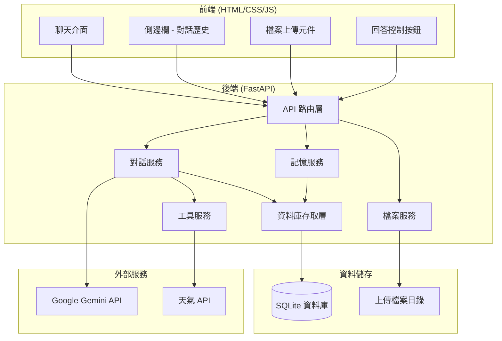
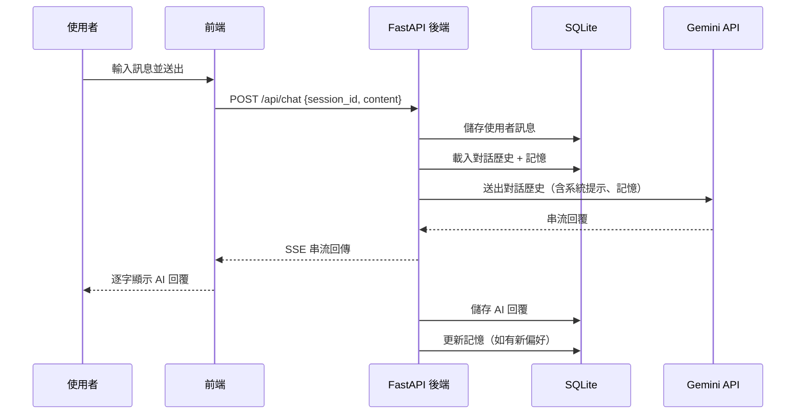
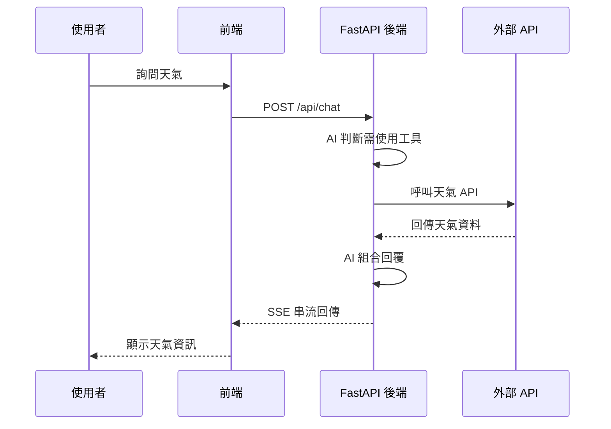

# 系統架構設計文件

## 1. 架構概覽



- **架構風格**：前後端分離的 RESTful API 架構，前端透過 AJAX/Fetch 與後端通訊，AI 回覆使用 Server-Sent Events (SSE) 實現串流。

## 2. 技術選型

| 層級 | 技術 | 說明 |
|------|------|------|
| 前端 | HTML + CSS + JavaScript | 純前端技術，無需建置工具，透過 Jinja2 模板引擎渲染 |
| 後端 | FastAPI (Python) | 高效能非同步 Web 框架，內建 OpenAPI 文件支援 |
| 資料庫 | SQLite + aiosqlite | 輕量級嵌入式資料庫，使用 aiosqlite 進行非同步操作 |
| AI 服務 | Google Gemini API | 使用 google-generativeai SDK 整合 |
| 模板引擎 | Jinja2 | FastAPI 內建支援，用於渲染 HTML 頁面 |
| 環境管理 | python-dotenv | 從 .env 檔案載入環境變數 |

## 3. 系統元件

### 3.1 前端（Frontend）

**頁面結構**：
- 單頁應用（SPA-like），所有互動透過 JavaScript 動態更新 DOM
- 左側：側邊欄（對話歷史列表 + 新增對話按鈕）
- 中間：主聊天區域（訊息列表 + 輸入框）
- 底部：輸入區（文字框 + 檔案上傳 + 送出按鈕）

**主要互動元件**：
- 訊息氣泡（區分使用者/AI，支援 Markdown 渲染）
- 對話歷史列表（可點擊切換、刪除）
- 檔案上傳預覽
- 重新生成 / 停止按鈕
- 記憶管理介面

**與後端的通訊方式**：
- RESTful API（JSON 格式）用於一般 CRUD 操作
- Server-Sent Events（SSE）用於 AI 串流回覆
- FormData 用於檔案上傳

### 3.2 後端（Backend）

**API 路由設計概覽**：見第 4 節

**核心模組與責任分工**：
- `ChatService`：管理對話流程，整合 Gemini API
- `MemoryService`：管理跨對話記憶的存取
- `ToolService`：管理工具定義與呼叫
- `FileService`：管理檔案上傳與存取
- `DB`：資料庫 CRUD 操作封裝

**中介層（Middleware）設計**：
- CORS 中介層：允許跨域請求（開發環境）
- 靜態檔案中介層：服務上傳的檔案

### 3.3 資料庫（Database）

- **資料庫類型**：SQLite（嵌入式，零配置）
- **選用原因**：部署簡單、無需額外服務、適合單機應用
- **資料表概覽**：
  - `sessions`：聊天室管理
  - `messages`：訊息儲存
  - `memories`：跨對話記憶

## 4. API 設計概覽

| 方法 | 路徑 | 說明 |
|------|------|------|
| GET | `/` | 渲染主頁面 |
| GET | `/api/sessions` | 取得所有聊天室列表 |
| POST | `/api/sessions` | 建立新聊天室 |
| DELETE | `/api/sessions/{id}` | 刪除聊天室 |
| GET | `/api/sessions/{id}/messages` | 取得指定聊天室的訊息 |
| POST | `/api/chat` | 送出訊息並取得 AI 回覆（SSE 串流） |
| POST | `/api/chat/regenerate` | 重新生成最後一條 AI 回覆 |
| POST | `/api/upload` | 上傳檔案 |
| GET | `/api/memories` | 取得所有記憶 |
| DELETE | `/api/memories/{id}` | 刪除指定記憶 |

## 5. 資料流





## 6. 安全性設計

- **API Key 保護**：Gemini API Key 存放於 `.env`，不提交至版本控制
- **檔案上傳驗證**：限制檔案類型（圖片、PDF、文字檔）與大小（10MB）
- **輸入驗證**：後端對所有使用者輸入進行驗證與清理
- **CORS 設定**：限制允許的來源

## 7. 部署架構

- **執行環境**：本機 Python 3.10+ 環境
- **啟動方式**：
  ```bash
  pip install -r requirements.txt
  cp .env.example .env
  # 編輯 .env 填入 GEMINI_API_KEY
  uvicorn app:app --reload
  ```
- **存取方式**：瀏覽器開啟 `http://localhost:8000`
