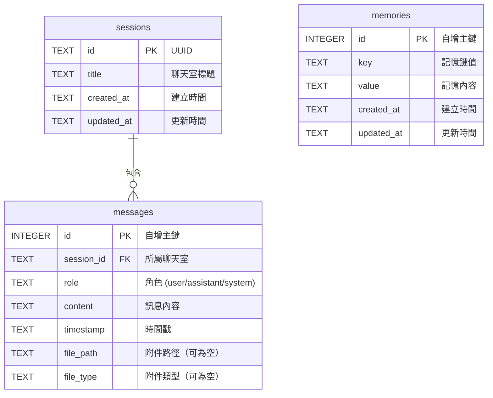
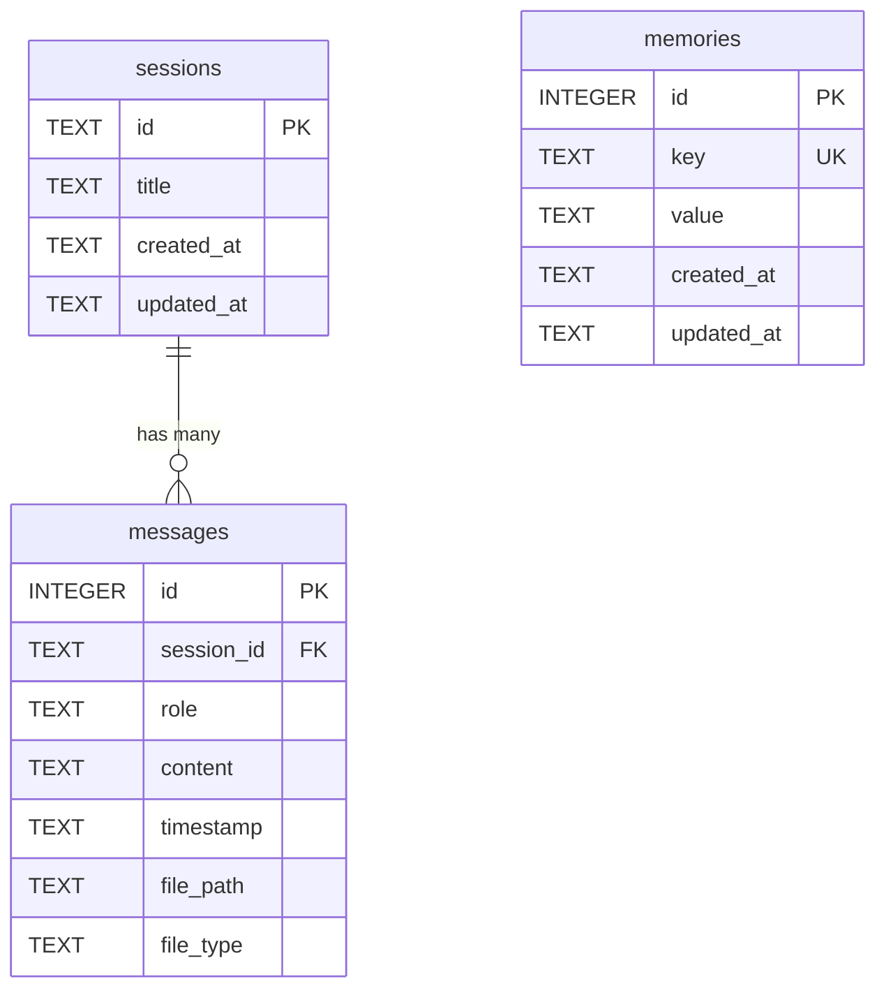

# 資料模型設計文件

## 1. 資料庫概覽

- **資料庫系統**：SQLite 3
- **存取方式**：透過 aiosqlite（非同步 SQLite 驅動）
- **資料庫檔案**：`chatbot.db`（應用啟動時自動建立）



## 2. 資料表定義

### 2.1 sessions（聊天室）

儲存每個聊天室的基本資訊。

| 欄位名稱 | 資料型態 | 約束條件 | 說明 |
|---------|---------|---------|------|
| id | TEXT | PRIMARY KEY | UUID 格式的唯一識別碼 |
| title | TEXT | NOT NULL, DEFAULT '新對話' | 聊天室標題，預設為「新對話」 |
| created_at | TEXT | NOT NULL | ISO 8601 格式的建立時間 |
| updated_at | TEXT | NOT NULL | ISO 8601 格式的最後更新時間 |

**索引**：
- `idx_sessions_updated_at` ON `sessions(updated_at DESC)` — 用於按更新時間排序

### 2.2 messages（訊息）

儲存所有聊天訊息，包含使用者與 AI 的訊息。

| 欄位名稱 | 資料型態 | 約束條件 | 說明 |
|---------|---------|---------|------|
| id | INTEGER | PRIMARY KEY AUTOINCREMENT | 自增主鍵 |
| session_id | TEXT | NOT NULL, FOREIGN KEY → sessions(id) ON DELETE CASCADE | 所屬聊天室 ID |
| role | TEXT | NOT NULL, CHECK(role IN ('user', 'assistant', 'system')) | 訊息角色 |
| content | TEXT | NOT NULL | 訊息文字內容 |
| timestamp | TEXT | NOT NULL | ISO 8601 格式的時間戳 |
| file_path | TEXT | 可為 NULL | 附件的伺服器端儲存路徑 |
| file_type | TEXT | 可為 NULL | 附件 MIME 類型 |

**索引**：
- `idx_messages_session_id` ON `messages(session_id)` — 用於依聊天室查詢訊息
- `idx_messages_timestamp` ON `messages(timestamp)` — 用於訊息排序

**關聯**：
- `session_id` → `sessions(id)`，ON DELETE CASCADE（刪除聊天室時同步刪除訊息）

### 2.3 memories（記憶）

儲存跨聊天室的使用者偏好與記憶資訊。

| 欄位名稱 | 資料型態 | 約束條件 | 說明 |
|---------|---------|---------|------|
| id | INTEGER | PRIMARY KEY AUTOINCREMENT | 自增主鍵 |
| key | TEXT | NOT NULL, UNIQUE | 記憶鍵值（如 "user_name", "preferred_language"） |
| value | TEXT | NOT NULL | 記憶內容 |
| created_at | TEXT | NOT NULL | ISO 8601 格式的建立時間 |
| updated_at | TEXT | NOT NULL | ISO 8601 格式的最後更新時間 |

**索引**：
- `idx_memories_key` ON `memories(key)` — 用於快速查詢特定記憶（UNIQUE 約束已自動建立）

## 3. 資料關聯圖



> **說明**：`memories` 表為全域性資料，不與特定 session 關聯，所有聊天室共用記憶。

## 4. 資料遷移策略

### 初始化方式

應用程式啟動時（FastAPI 的 `lifespan` 事件），自動執行以下 SQL 建立資料表：

```sql
CREATE TABLE IF NOT EXISTS sessions (
    id TEXT PRIMARY KEY,
    title TEXT NOT NULL DEFAULT '新對話',
    created_at TEXT NOT NULL,
    updated_at TEXT NOT NULL
);

CREATE TABLE IF NOT EXISTS messages (
    id INTEGER PRIMARY KEY AUTOINCREMENT,
    session_id TEXT NOT NULL,
    role TEXT NOT NULL CHECK(role IN ('user', 'assistant', 'system')),
    content TEXT NOT NULL,
    timestamp TEXT NOT NULL,
    file_path TEXT,
    file_type TEXT,
    FOREIGN KEY (session_id) REFERENCES sessions(id) ON DELETE CASCADE
);

CREATE TABLE IF NOT EXISTS memories (
    id INTEGER PRIMARY KEY AUTOINCREMENT,
    key TEXT NOT NULL UNIQUE,
    value TEXT NOT NULL,
    created_at TEXT NOT NULL,
    updated_at TEXT NOT NULL
);

CREATE INDEX IF NOT EXISTS idx_sessions_updated_at ON sessions(updated_at DESC);
CREATE INDEX IF NOT EXISTS idx_messages_session_id ON messages(session_id);
CREATE INDEX IF NOT EXISTS idx_messages_timestamp ON messages(timestamp);
```

### 種子資料

不需要預設種子資料。首次使用時，使用者建立新聊天室即會自動產生資料。

## 5. 資料驗證規則

| 資料表 | 欄位 | 驗證規則 |
|--------|------|---------|
| sessions | title | 非空字串，最大長度 200 字元 |
| messages | role | 必須為 'user'、'assistant' 或 'system' 之一 |
| messages | content | 非空字串 |
| messages | file_type | 若有附件，必須為允許的 MIME 類型 |
| memories | key | 非空字串，全域唯一，限英文與底線 |
| memories | value | 非空字串，最大長度 1000 字元 |
